This project is a healthcare application for examining infected people with COVID-19 developed using Flutter + Firebase for the backend. The application is available in both languages Arabic and English.

The application consists of 9 screens: 
* Main screen.
Arabic English
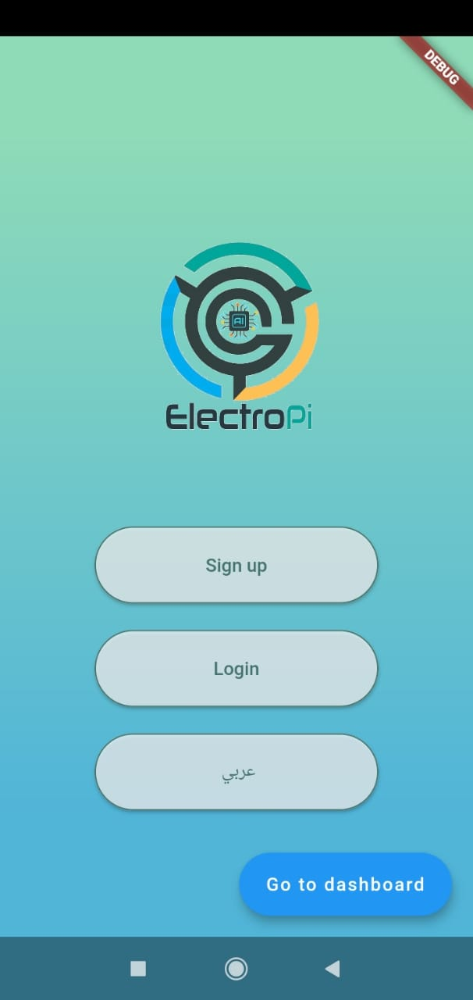   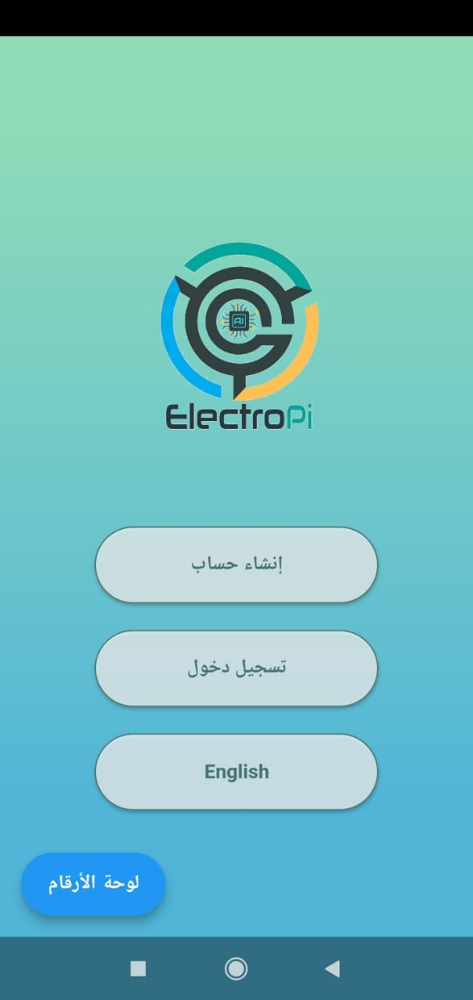

* Sign up screen.
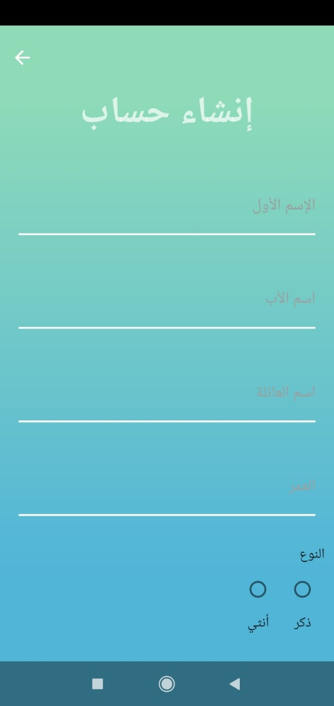
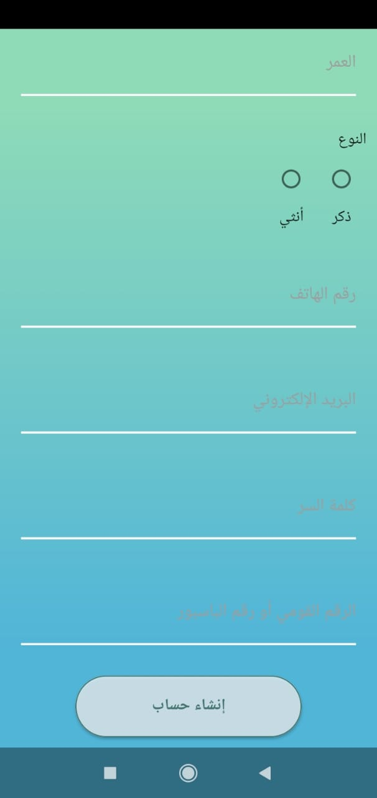

* Sign in screen.

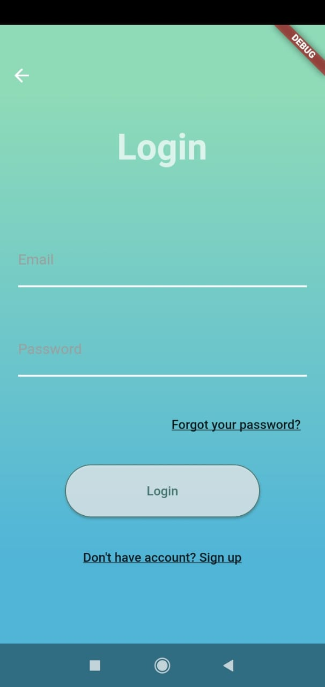

* Forgot password screen.
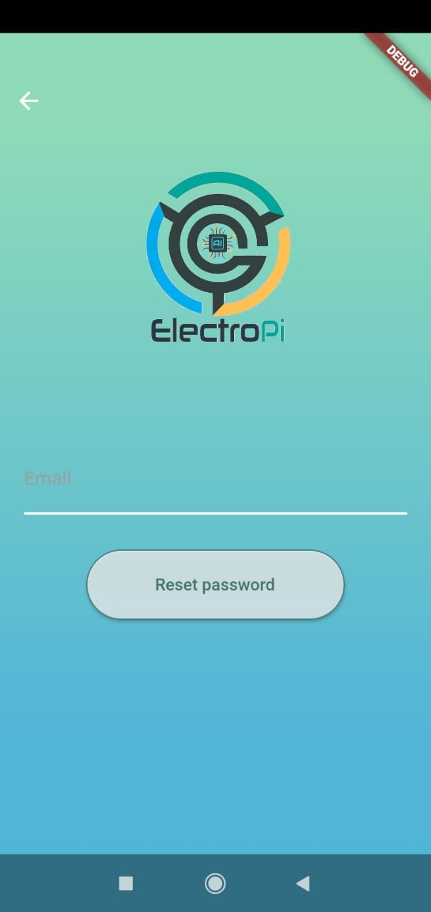 
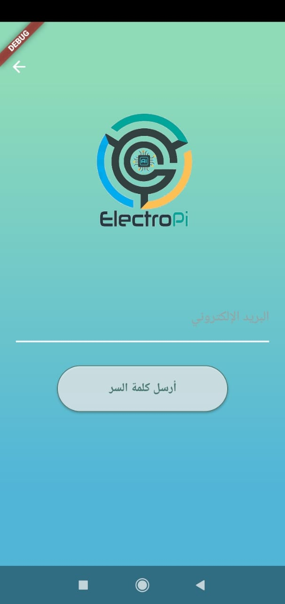

* Dashboard screen.
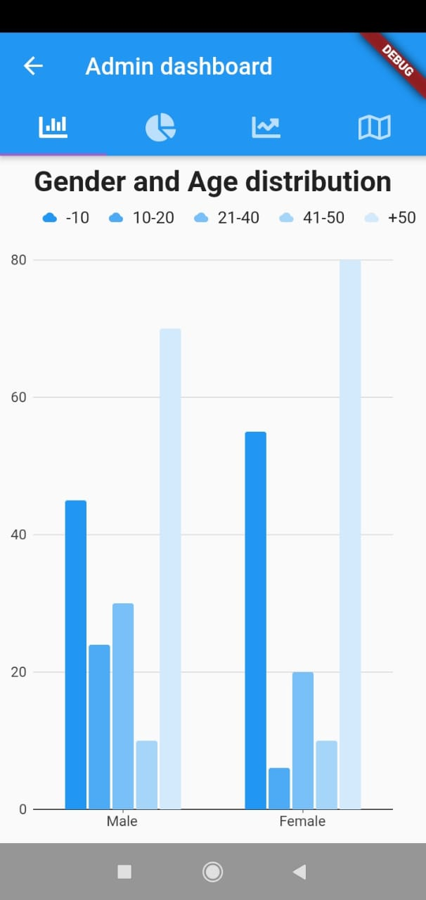
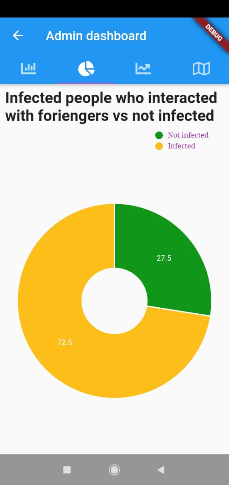
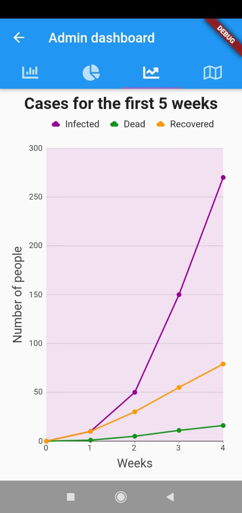
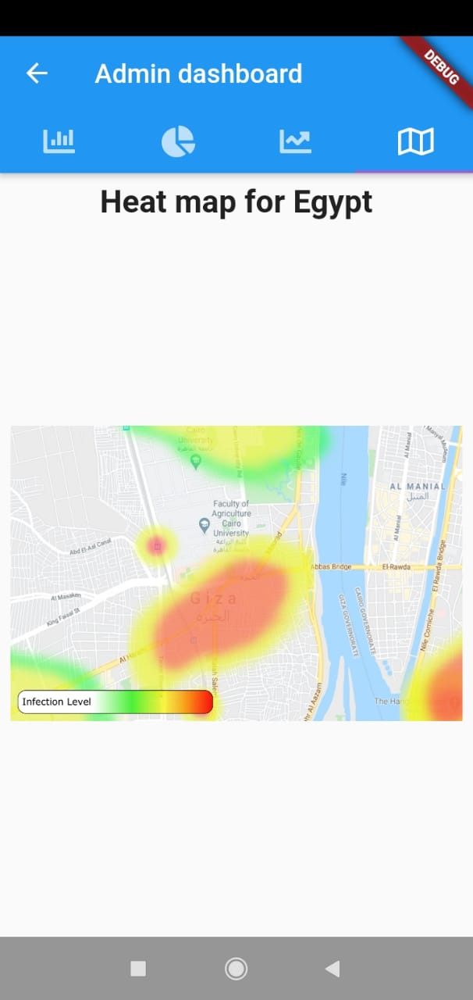

* Home page screen
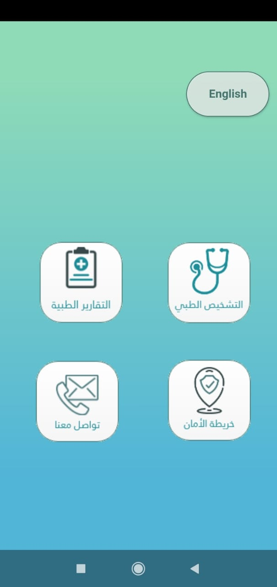

* Examination screen
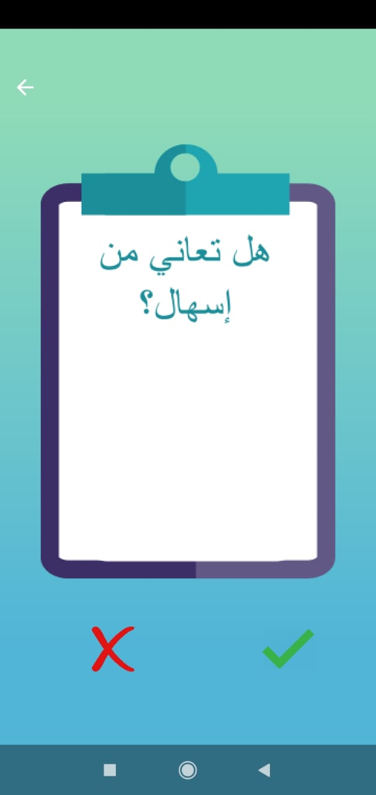

* Medical report screen
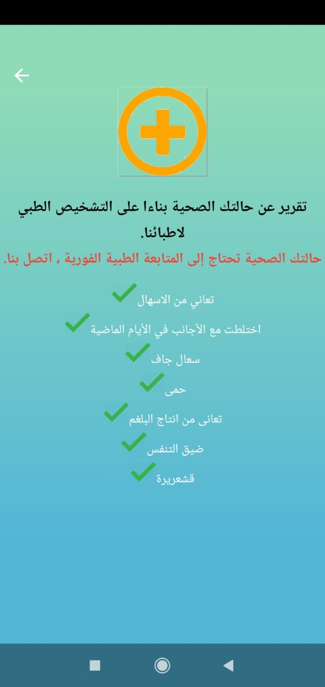
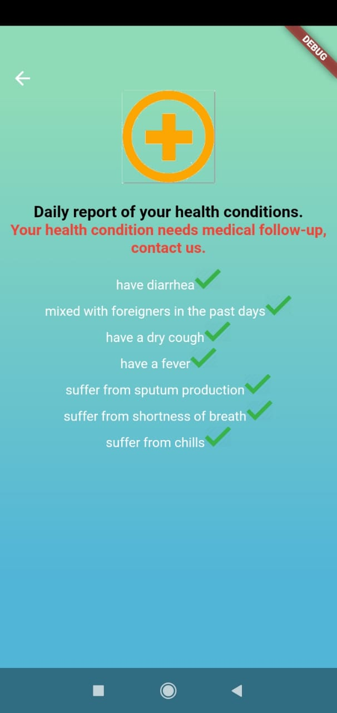

* Contact us screen
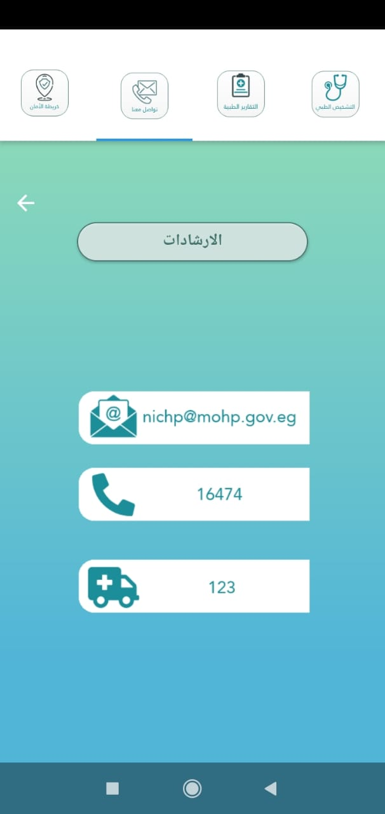

* Instructions screen
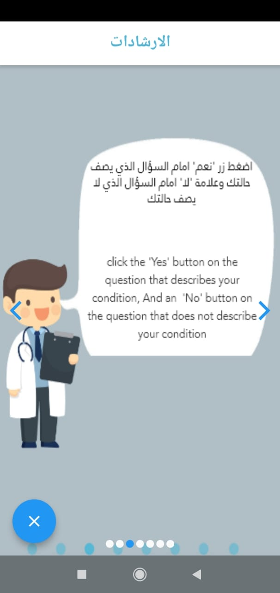
